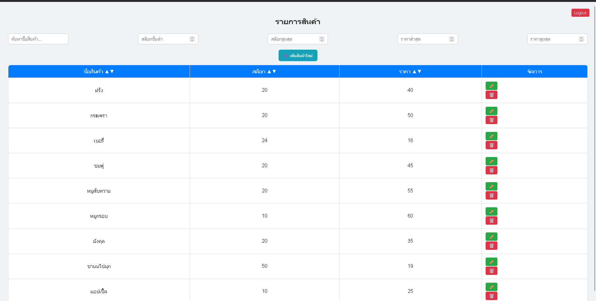

# Stock Management System

A web-based stock management system to track products, quantities, and inventory levels using Firebase as the backend.

## Features
- Add, edit, and delete products
- Track product quantities in real-time
- Search and filter products
- Generate simple reports
- User-friendly interface for easy management

## Technologies
- HTML
- CSS
- JavaScript
- Firebase (Realtime Database / Firestore)

## How to Run
1. Clone or download this repository
2. Open `add.html`/ `list.html`/ `login.html`  in your browser
3. Make sure you have the Firebase configuration set up in your project
4. Start managing your products!

## Screenshots

## Author
- Name: [sundusit pumpeda]
- GitHub: [https://github.com/sundusitp](https://github.com/sundusitp)
